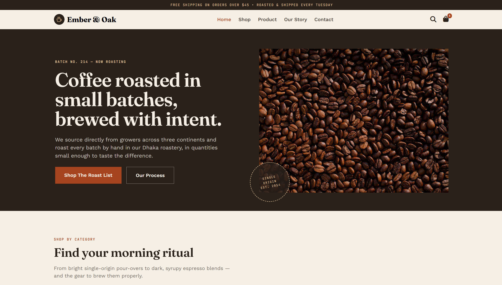
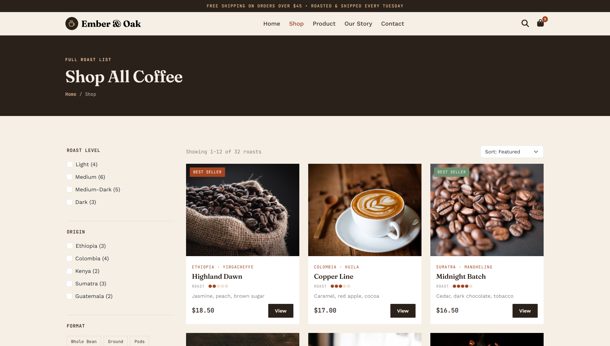
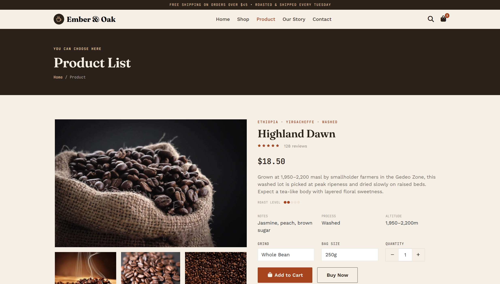
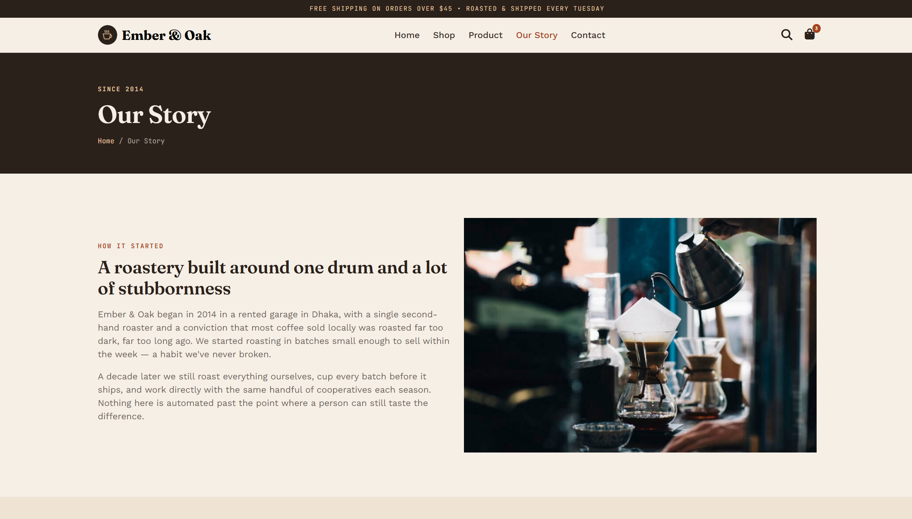
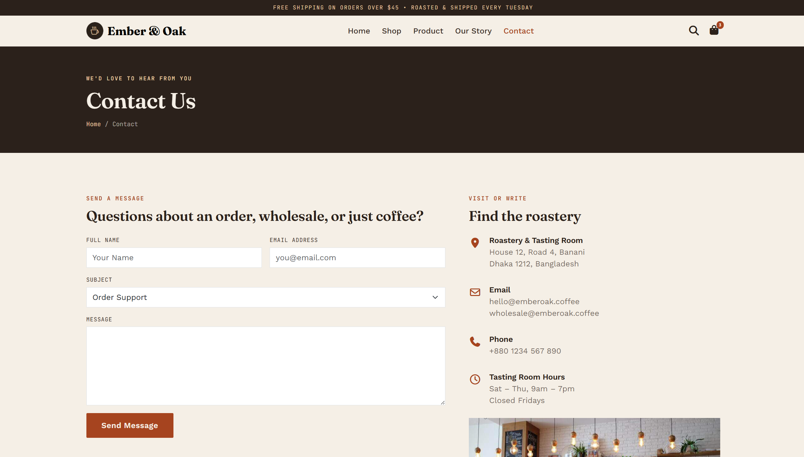

<div align="center">

# 🛒 E-Commerce Website


### _A Sleek, Fully Responsive E-Commerce Platform_

**Built with HTML5 · CSS3 · Bootstrap 5**

<br/>


[]()
[](https://github.com/dipu-ray/e-commerce-website/issues)
[](https://github.com/dipu-ray/e-commerce-website/issues)

<br/>


</div>

---

## 📖 Table of Contents

- [✨ About The Project](#-about-the-project)
- [🗂️ Pages Overview](#️-pages-overview)
- [🛠️ Tech Stack](#️-tech-stack)
- [🎨 Features](#-features)
- [📁 Project Structure](#-project-structure)
- [📸 Screenshots](#-screenshots)
- [🎨 Color Palette](#-color-palette)
- [👤 Author](#-author)

---

## ✨ About The Project

> _"Shopping is not just buying things. It's an experience."_

**E-Commerce Website** is a fully responsive, multi-page digital storefront built entirely with **HTML5**, **CSS3**, and **Bootstrap 5**. It delivers a premium online shopping experience, from the first glance at the dynamic product carousel to the final sleek checkout page.

Whether you're a business owner looking for an elegant digital storefront or a developer seeking a clean Bootstrap project as inspiration, this template delivers a polished, production-ready result.

---

## 🗂️ Pages Overview

|  #  | Page             | Description                                                      |
| :-: | ---------------- | ---------------------------------------------------------------- |
| 01  | 🏠 **Home**      | Hero banner, featured categories, special deals & call-to-action |
| 02  | 🛍️ **Shop**      | Full product listings with grid layouts, sorting, and filters    |
| 03  | 📦 **Product**   | Detailed product views, specifications, gallery, and reviews     |
| 04  | 📖 **Our Story** | Brand history, mission statement, values, and team overview      |
| 05  | 📞 **Contact**   | Store location, support channels, live chat, and inquiry form    |

---

## 🛠️ Tech Stack

```
Frontend
├── HTML5        → Semantic, accessible markup structure
├── CSS3         → Custom styling, overrides & specific utility layout tweaks
├── Bootstrap 5  → Component-driven framework for rapid UI development
│   ├── Grid System  → Responsive rows and columns for product layouts
│   ├── Flex Utilities → Flexible one-dimensional positioning and alignment
│   ├── Components   → Built-in navbars, carousels, badges, and modal carts
│   ├── Utility Classes → Fast padding, margin, color, and border styling
│   └── JavaScript Components → Interactive dropdowns, tooltips, and collapse menus
```

---

## 🎨 Features

### 🌟 Core Features

- ✅ **Multi-Page Architecture** — 5 fully linked, standalone HTML pages
- ✅ **Fully Responsive** — Pixel-perfect layouts powered by the Bootstrap 5 grid system
- ✅ **Semantic HTML5** — Proper use of `<header>`, `<nav>`, `<main>`, `<section>`, `<article>`, `<footer>`
- ✅ **Bootstrap 5 Utility & Flex** — Highly efficient spacing, utility-first layout control
- ✅ **Custom CSS Variables** — Easily customizable theme colors for fast brand overrides
- ✅ **Interactive Components** — Dropdowns, dynamic navbar, and popups with zero manual JS

### 🛍️ Page-Specific Features

- 🏠 **Hero Section** Basic idea of products
- 🛍️ **Product Filter Sidebar** — Dynamic Bootstrap collapse menus for price, size, and category filters
- 📦 **Product Detail Gallery** — Multi-image preview layouts with tabbed specification sheets
- 📖 **Our Story** — Responsive flex-row grid showcasing brand milestones and team cards
- 📞 **Contact & Live Support** — Embedded Google Maps mockup with interactive inquiry forms

### 🎯 Design Highlights

- 🎨 Clean, modern retail theme with high-contrast call-to-action elements
- 🖋️ Google Fonts — Premium, high-readability typography pairing for retail
- 🛒 Floating shopping cart badge with hover state indicators
- 🔗 Sticky top Bootstrap navbar with smooth scrolling integration
- 📱 Native Bootstrap mobile offcanvas/hamburger menu
- ♿ Built-in Bootstrap accessibility features with complete ARIA labels

---

## 📁 Project Structure

```
e-commerce-website/                → Git repo or project name
│
├── 📄 index.html                  → Home Page
├── 📄 shop.html                   → Shop Page
├── 📄 product.html                → Product List Page
├── 📄 our-story.html              → About or Our Story Page
├── 📄 contact.html                → Contact Page
│
├── 📁 assets/
│   ├── 📁 images/                  → All Images
│   │   ├── 📁 backgrounds/         → Background Images
│   │   ├── 📁 common/              → Icons
│   │   ├── 📁 content/             → Pages Images
│   ├── 📁 style/                   → CSS file
│   │   ├── style.css               → Global styles & variables
│
└── 📄 README.md                 → Project Documentation & Overview
```

---

## 📸 Screenshots

<div align="center">

|                  Home Page                   |                  Shop Page                   |
| :------------------------------------------: | :------------------------------------------: |
|  |  |

|                    Product Page                    |                     Our Story                      |
| :------------------------------------------------: | :------------------------------------------------: |
|  |  |

|                    Contact Page                    |
| :------------------------------------------------: |
|  |

</div>

---

## 🎨 Color Palette

```css
:root {
  --espresso: #2B211B; /* Rich Espresso */
  --espresso-2: #3A2E27; /* Dark Mocha */
  --cream: #F5EFE6; /* Warm Cream */
  --cream-2: #EFE4D3; /* Soft Almond */
  --rust: #A6441F; /* Terracotta Rust */
  --rust-dark: #863518; /* Deep Crimson Rust */
  --tan: #E8C9A0; /* Sandy Tan */
  --sage: #6B8F71; /* Muted Sage Green */
  --line: rgba(43, 33, 27, 0.14); /* Subtle Border Line *
}
```

---

## 📐 Responsive Breakpoints

```css
@media screen and (max-width: 1400px) {
  /* Ultra-Wide Monitors & Large Desktops */
}

@media screen and (max-width: 1200px) {
  /* Standard Desktop Monitors and Larger Laptops */
}

@media screen and (max-width: 992px) {
  /* Large Tablets in Landscape mode and Small Laptops */
}

@media screen and (max-width: 768px) {
  /* Tablets in Portrait mode and Extra Large Smartphones */
}

@media screen and (max-width: 576px) {
  /* Standard Mobile Phones in Landscape mode */
}

@media screen and (max-width: 450px) {
  /* Standard Mobile Phone held vertically (Portrait Mode) */
}
```

---

## 👤 Author

<div align="center">

**Dipu Ray**

[](https://github.com/dipu-ray/)
[](https://www.linkedin.com/in/dipu-ray/)
[](https://dipu-ray.github.io/)

</div>

---

<div align="center">

### ⭐ Star this repo if you found it helpful!

_Made with ❤️ and a lot of ☕_

**[🔝 Back to Top](#-e-commerce-website)**

</div>
